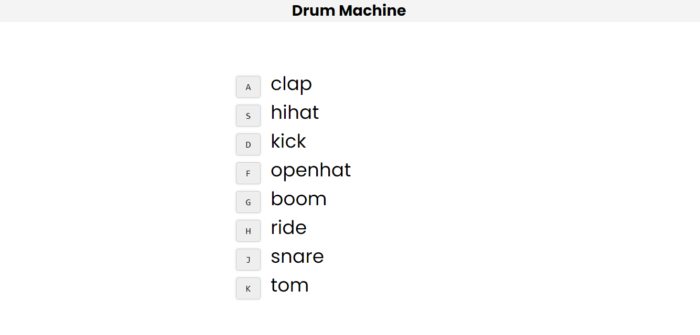

# Drum Machine

A simple, interactive drum machine application that allows users to play different drum sounds by pressing corresponding keys on their keyboard. This project showcases basic JavaScript functionalities and DOM manipulation techniques.

## Features

- Play different drum sounds by pressing specific keys
- Visual feedback when a key is pressed
- Resetting the sound playback for rapid drum beats

## Demo



## Getting Started

### Prerequisites

To run this project locally, you need a web browser and a local server environment or simply open the `index.html` file directly in your browser.

### Installation

1. Clone the repository:

   ```sh
   git clone https://github.com/HopSoft-Tech/drum-machine.git
   ```

2. Navigate to the project directory:

   ```sh
   cd drum-machine
   ```

3. Open the `index.html` file in your browser:

   ```sh
   open index.html
   ```

## Usage

1. Press the keys `A`, `S`, `D`, `F`, `G`, `H`, `J`, or `K` to play different drum sounds.
2. Observe the visual feedback on the corresponding key elements.

## Project Structure

```
drum-machine/
├── sounds/
│   ├── clap.wav
│   ├── hihat.wav
│   ├── kick.wav
│   ├── openhat.wav
│   ├── boom.wav
│   ├── ride.wav
│   ├── snare.wav
│   └── tom.wav
├── app.js
├── index.html
├── style.css
└── images/
    └── demo.png
```

### Code Overview

Here's a brief overview of the key parts of the code:

#### HTML

The HTML structure provides the layout for the drum machine, including key elements and audio sources.

```html
<!DOCTYPE html>
<html lang="en">
  <head>
    <meta charset="UTF-8" />
    <meta http-equiv="X-UA-Compatible" content="IE=edge" />
    <meta name="viewport" content="width=device-width, initial-scale=1.0" />
    <link rel="stylesheet" href="style.css" />
    <script src="app.js" defer></script>
    <title>Drum Machine</title>
  </head>
  <body>
    <header>
      <h1>Drum Machine</h1>
    </header>
    <div class="keys">
      <div data-key="65" class="key">
        <kbd>A</kbd>
        <span class="sound">clap</span>
      </div>
      <div data-key="83" class="key">
        <kbd>S</kbd>
        <span class="sound">hihat</span>
      </div>
      <div data-key="68" class="key">
        <kbd>D</kbd>
        <span class="sound">kick</span>
      </div>
      <div data-key="70" class="key">
        <kbd>F</kbd>
        <span class="sound">openhat</span>
      </div>
      <div data-key="71" class="key">
        <kbd>G</kbd>
        <span class="sound">boom</span>
      </div>
      <div data-key="72" class="key">
        <kbd>H</kbd>
        <span class="sound">ride</span>
      </div>
      <div data-key="74" class="key">
        <kbd>J</kbd>
        <span class="sound">snare</span>
      </div>
      <div data-key="75" class="key">
        <kbd>K</kbd>
        <span class="sound">tom</span>
      </div>
    </div>

    <audio data-key="65" src="sounds/clap.wav"></audio>
    <audio data-key="83" src="sounds/hihat.wav"></audio>
    <audio data-key="68" src="sounds/kick.wav"></audio>
    <audio data-key="70" src="sounds/openhat.wav"></audio>
    <audio data-key="71" src="sounds/boom.wav"></audio>
    <audio data-key="72" src="sounds/ride.wav"></audio>
    <audio data-key="74" src="sounds/snare.wav"></audio>
    <audio data-key="75" src="sounds/tom.wav"></audio>
  </body>
</html>
```

#### JavaScript

The JavaScript file (`app.js`) contains the core logic of the drum machine, including sound playback and visual feedback.

```javascript
window.addEventListener("keydown", playSound);

function playSound(e) {
  const audio = document.querySelector(`audio[data-key="${e.keyCode}"]`);
  const key = document.querySelector(`.key[data-key="${e.keyCode}"]`);

  if (!audio) return;

  audio.currentTime = 0;
  audio.play();

  key.classList.add("playing");
  setTimeout(() => {
    key.classList.remove("playing");
  }, 100);
}
```

## Contributing

Feel free to contribute to this project by submitting issues or pull requests.

1. Fork the repository.
2. Create a new branch.
3. Make your changes and commit them.
4. Push to the branch.
5. Open a pull request.

## License

This project is licensed under the MIT License. See the [LICENSE](LICENSE) file for details.
